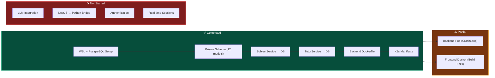
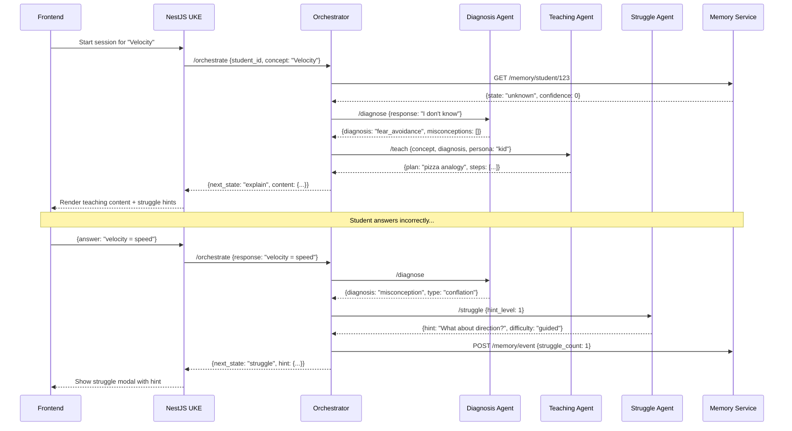
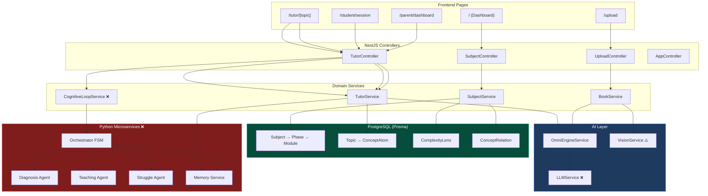

# Ekaguru — Implementation Roadmap & UI Vision

> **"Deconstruct knowledge into pure atoms. Reconstruct them instantly to fit the learner's mind."**

---

## What the UKE Architecture Document Adds (New Inputs)

The UKE Architecture doc introduces 6 specific concepts **not yet reflected** in the codebase or previous roadmap. Each is mapped below.

| # | New Concept | Where It Fits | Current State |
|---|-------------|--------------|---------------|
| 1 | **Visual Layout Analysis (VLA)** — "look at the page before reading" to separate Headers/Sidebars/Captions/Diagrams from body text | Phase 1 → `BookService` upgrade → `StructuredParser` | BookService uses regex heuristics; no VLA |
| 2 | **Three-Lens Naming System** — Storyteller / Analyst / First-Principles Thinker (richer than Kid/Student/Genius) | Phase 1 → `OmniEngineService` + `ComplexityLens` | Generic persona names, no differentiated logic per lens |
| 3 | **Historical Context** metadata per concept — e.g. "Newton's formulation..." | Phase 1 → Prisma schema + `ComplexityLens` model | `ComplexityLens` has `narrative`, `analogy`, `visualPrompt` — missing `historicalContext` |
| 4 | **Prerequisites Graph (wired)** — `ConceptRelation` with `PREREQUISITE` type surfaced in UI | Phase 2 → `/tutor/[topic]` concept map | Schema exists (`ConceptRelation.PREREQUISITE`) but UI never shows it |
| 5 | **OCR + Text Layer Verification** — for image-heavy PDFs, verify text layer against OCR to fix encoding errors | Phase 1 → `BookService.processPage()` | `VisionService` is a stub returning hardcoded string |
| 6 | **StructuredParser** as a named component — hierarchy detection via font-size and indentation | Phase 1 → `BookService` | Current header detection: `caps/numbered/title case` heuristics only |

> [!IMPORTANT]
> The `refined_architecture.md` file (Section 6.1 and Section 12) still says "ALL IN-MEMORY" and "Database (NestJS): None" — **both are now false** after the Prisma migration. That file needs updating.

---

## Current State Summary

---

## Phase 0: Stabilize (Days 1-3)
> Get everything running in K8s before building new features.

| Task | Detail | Effort |
|------|--------|--------|
| Fix backend health probe | Verify `AppController` with `GET /` is deployed | 30 min |
| Fix frontend Docker build | Debug `npm run build` failure in Docker, add `.env` handling | 2 hrs |
| Load images into KinD | `kind load docker-image` for both services | 15 min |
| Run Prisma migrations | Add init container or startup script for `prisma migrate deploy` | 1 hr |
| End-to-end smoke test | Access frontend → create subject → verify in DB | 30 min |

**Exit Criteria:** Both pods `Running`, frontend accessible at `localhost:30080`, subject persists across pod restart.

---

## Phase 1: Intelligence Layer (Days 4-18)
> Replace heuristics with real LLM reasoning — this is what makes it "world-class."

### Week 1: BookService — StructuredParser + VLA

> This comes *before* LLM integration because it determines the quality of input to the LLM.

| Task | Files Changed | What Changes |
|------|--------------|-------------|
| **StructuredParser** | `book.service.ts` | Replace regex header detection with font-size + indentation hierarchy detection. Goal: 99% accuracy separating Header/Content/Caption/Sidebar |
| **VLA — Visual Layout Analysis** | `book.service.ts` | Before reading text, classify page regions: identify diagrams, sidebars, captions as distinct from body text. Prevents mixing caption into paragraph content |
| **OCR + Text Layer Verification** | `vision.service.ts` | For image-heavy pages: run OCR, compare against embedded text layer, fix encoding errors. Replaces current hardcoded stub |
| **Image Contextualization** | `vision.service.ts` | Use Gemini Vision to read charts/graphs and generate descriptive alt-text. "Figure 1.1" becomes searchable knowledge |

### Week 2: Gemini LLM Integration

| Task | Files Changed | What Changes |
|------|--------------|-------------|
| Add Gemini SDK | `package.json`, new `llm.service.ts` | `@google/generative-ai` dependency |
| Replace `mockLlmCall()` | `template.service.ts` | Real API calls with prompt templates |
| Smart Concept Extraction | `omni.service.ts` → `extractAtomicConcepts()` | Replace word-frequency with Gemini structured output |
| **Three-Lens Generation** | `omni.service.ts` → `generatePersonaLenses()` | Generate 3 distinct lens types — see below |
| Caching Layer | New `llm-cache.service.ts` | Redis/Map cache to avoid re-calling LLM for same concept |
| **Historical Context** | `prisma/schema.prisma` + `ComplexityLens` | Add `historicalContext String?` field — e.g. "Newton first formulated this in 1687..." |

#### The Three-Lens System (from UKE Architecture)

Replace generic personas with these semantically distinct lenses:

| Lens | Name | Target | Logic | Focus | Prompt Style |
|------|------|--------|-------|-------|-------------|
| 1 | **The Storyteller** | Kids / Beginners | Semantic simplifier + Narrative wrapper | HOW it feels, WHY it matters | "Once upon a time..." / gaming analogies |
| 2 | **The Analyst** | Students / Intermediate | Structural breakdown + curriculum alignment | WHAT it is, HOW to calculate | Textbook definitions, formula derivation, bullet points |
| 3 | **The First-Principles Thinker** | Genius / Advanced | Abstract generalization + interdisciplinary connections | Deep derivation, edge cases, limits of theory | Socratic questioning — e.g. tie "Velocity" in Physics to "Rate of Change" in Economics |

> The current `TargetRole` enum has: `KID`, `STUDENT`, `PROFESSIONAL`, `ARCHITECT`, `PROFESSOR`, `RESEARCHER`. Map these to: KID/STUDENT → Storyteller, PROFESSIONAL/ARCHITECT → Analyst, PROFESSOR/RESEARCHER → First-Principles Thinker.

### Week 3: Enhanced Knowledge Graph

| Task | What It Unlocks |
|------|----------------|
| Dynamic edge generation | LLM determines concept relationships (not hardcoded Velocity→Time) |
| **Prerequisites graph wired to UI** | `ConceptRelation.PREREQUISITE` surfaced in `/tutor/[topic]` as "You need to understand X first" |
| Quality scoring | LLM validates extracted atoms for accuracy + hallucination check |
| Topic tree expansion | Replace hardcoded "OpenShift"/"Kubernetes" trees with LLM-generated sub-topics |
| Contextual Q&A | `answerQuestion()` uses RAG over persisted atoms instead of keyword matching |

**Exit Criteria:** Upload a PDF → atoms extracted by Gemini → lenses are natural language → Q&A gives contextual answers.

---

## Phase 2: Stack Unification (Days 19-35)
> Connect the NestJS brain to the Python nervous system.

| Task | Detail |
|------|--------|
| Add `HttpModule` to NestJS | Enable NestJS to call Python services |
| Create `CognitiveLoopService` | Orchestrates the full session flow from NestJS side |
| Wire student session page | Frontend `/student/session` → NestJS → Orchestrator → Agents |
| Add WebSocket gateway | Real-time session state updates (not polling) |
| Event sourcing | All learning events flow to Memory Service for analytics |

**Exit Criteria:** Student starts a session → FSM transitions through observe/diagnose/struggle/explain/reflect → mastery recorded in DB.

---

## Phase 3: Trust & Human Layer (Days 36-55)
> Parents need to see what's happening. Students need to feel safe.

| Task | Page | Backend |
|------|------|---------|
| Real parent analytics | `/parent/dashboard` | Aggregate events from Memory Service |
| Child profile management | `/parent/child-setup` | JWT-scoped parent-child relationships |
| Fear/confidence tracking | `/parent/dashboard` | Recharts visualization from real data |
| Session recordings | `/parent/sessions` | Timestamped event replay |
| COPPA consent flow | `/parent/consent` | Parental consent before child can use |
| Avatar integration | Session pages | Wire `avatar_controller` to emotional state |

---

## Phase 4: Production & Pilot (Days 56-75)

| Task | Detail |
|------|--------|
| Auth (JWT + Passport) | Protect all routes, parent/student/admin roles |
| Rate limiting | Prevent LLM cost abuse |
| Monitoring (Prometheus) | CPU, memory, LLM latency, error rates |
| CI/CD pipeline | GitHub Actions → Docker build → ArgoCD deploy |
| Pilot: 25 families | Onboard, track, collect feedback |
| Iterate on feedback | Tune LLM prompts, fix UX pain points |

---

## UI Vision — How Each Page Will Look

Below are the 5 core screens that form the Ekaguru experience. Each maps directly to a backend capability.

---

### 1. Student Dashboard (Home)
> **Route:** `/` → **Backend:** `SubjectService.findAll()`, `getIngestionProgress()`

The student's command center. Shows active subjects with mastery progress, a live knowledge graph visualization of learned concept atoms, and quick stats.

**What's connected:**
- Subject cards pull from `prisma.subject.findMany()` ✅ (already works)
- Knowledge graph nodes are `ConceptAtom` records with `ComplexityLens` data ✅ (schema exists)
- Progress bars come from `getIngestionProgress()` ✅ (already implemented)

---

### 2. Tutor — Jarvis Mode (Split Screen)
> **Route:** `/tutor/[topic]` → **Backend:** `TutorService.getPersonaExplanation()`

The signature Ekaguru experience. Left panel shows the concept through the selected persona lens (Kid gets stories, Student gets analysis, Genius gets Socratic questions). Right panel shows the visual concept map and formulas.

**What's connected:**
- Persona toggle calls `getPersonaExplanation(topic, persona)` ✅ (works, uses DB)
- Concept map built from `ConceptRelation` records ⚠️ (schema exists, edges are hardcoded)
- "Ask Tutor" uses `answerQuestion()` ⚠️ (works but keyword-matching, needs LLM)

---

### 3. Book Upload & Knowledge Extraction
> **Route:** `/upload` → **Backend:** `BookService.processBook()`, `SubjectService.processBookContent()`

Drop a PDF → watch it get deconstructed into atomic knowledge. The 4-stage pipeline (PDF Analysis → Structure Detection → Atom Extraction → Lens Generation) runs in real-time with progress indicators.

**What's connected:**
- PDF upload calls `UploadController` → `BookService` (4,427 LOC) ✅ (works)
- Structure detection uses header heuristics ✅ (algorithmic, works)
- Atom extraction uses `OmniEngineService` ⚠️ (word-frequency, needs LLM in Phase 1)
- Lens generation creates `ComplexityLens` records in DB ✅ (Prisma, works)

---

### 4. Active Learning Session (Cognitive Loop)
> **Route:** `/student/session` → **Backend:** `CognitiveLoopService` → Python Orchestrator FSM

This is the heart of the system. The student interacts in a conversation-style interface while the FSM silently manages the pedagogical flow (Observe → Diagnose → Struggle → Explain → Reflect → Transfer → Master). The "Productive Struggle" hints appear when the student is stuck — giving just enough scaffolding without giving the answer.

**What's connected:**
- FSM logic exists in Python `orchestrator/fsm.py` ✅ (5 transition rules)
- Struggle agent provides hint levels ✅ (3 difficulty tiers)
- Session state tracking ❌ (needs Stack Unification in Phase 2)
- Real-time updates ❌ (needs WebSocket gateway in Phase 2)

---

### 5. Parent Dashboard (Analytics)
> **Route:** `/parent/dashboard` → **Backend:** `TutorService.getStudentProgress()`, Memory Service analytics

The parent's window into their child's cognitive growth. Shows mastery metrics, learning trends over time, fear-vs-confidence breakdown by subject, and a real-time feed of learning events (mastered concepts, detected misconceptions, struggle resolutions).

**What's connected:**
- Basic stats from `getStudentProgress()` ✅ (works, returns from DB)
- Weekly progress chart ⚠️ (exists but hardcoded data in TutorService)
- Fear/confidence tracking ❌ (needs Diagnosis Agent integration in Phase 2)
- Real event feed ❌ (needs Memory Service events in Phase 2)

---

## Page → Backend → Data Flow

> Items marked ❌ are not yet implemented. Items marked ⚠️ are stubs/mocks.

---

## Timeline Summary

| Phase | Duration | Key Deliverable | Risk |
|-------|----------|----------------|------|
| **Phase 0: Stabilize** | Days 1-3 | Both pods Running in K8s | Low |
| **Phase 1: Intelligence** | Days 4-18 | LLM-powered atom extraction + persona lenses | Medium (API costs, prompt tuning) |
| **Phase 2: Unification** | Days 19-35 | Full cognitive loop working end-to-end | High (cross-stack integration) |
| **Phase 3: Trust** | Days 36-55 | Parent dashboard with real data, auth | Medium |
| **Phase 4: Pilot** | Days 56-75 | 25 families using the product | High (real-world issues) |

**Total: 75 working days to a pilot-ready product.**

---

## Anti-Goals (From Your PRD)
These are explicitly **NOT** in scope:
- ❌ Gamification (no points, badges, leaderboards)
- ❌ Exams or marks (mastery is measured by transfer, not tests)
- ❌ Too many subjects at launch (start with 1-2 subjects only)
- ❌ Fancy animations that distract from learning
- ❌ Social features (no chat, no comparison with peers)

---

*This roadmap is grounded in the actual codebase state as of April 9, 2026. Every "✅ works" claim has been verified against the running code. Every "❌ missing" is a real gap in the implementation.*
