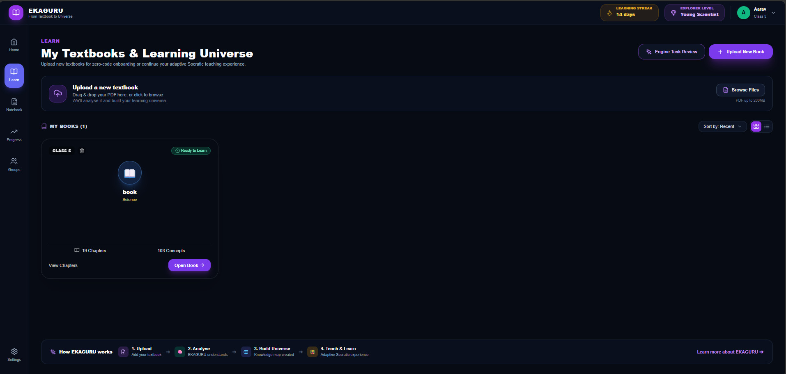
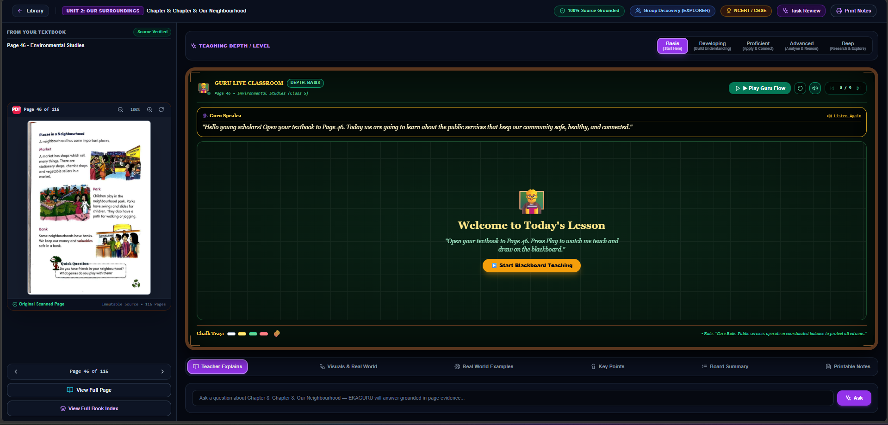

# Approved EKAGURU interface and integration contract

User-approved design references, supplied 10 September 2026. These are the existing product screens to preserve while implementing the textbook-to-Guru pipeline. This decision supersedes using PageGroundedStudio's replacement layout as the final product interface.

## Library and learning universe

Preserve the existing application header and navigation rail, dark theme, purple accents, upload area, book cards, view/sort controls, chapter links, Open Book action, and bottom explanation of the upload-to-learning journey. The implementation entry point is `universal/frontend/components/learning/EkaguruLearnHome.tsx`.

Connect upload status, book metadata, chapter/concept counts and learner indicators to actual data. Values shown in the screenshot are examples, not requirements to hardcode the same learner, streak, counts or book.

## Textbook and Guru classroom

Preserve:
- The existing top toolbar, textbook/chapter context, task review and print actions.
- The left textbook panel with the actual page scan, zoom, rotation, physical-page navigation, full-page view and book index.
- The five purple teaching-depth controls above the classroom.
- The prominent green, wood-framed Guru board, narration strip, progressive drawing area, playback/navigation controls and chalk-tray styling.
- The teaching/explanation, visuals, examples, key-points, summary and printable-notes tabs.
- The page-grounded question input below the classroom.

The approved shell is implemented by `PageGroundedStudio` and `PageTeachingBoard` in `universal/frontend/components/learning/`; `UniversalKnowledgeUniverseStudio.tsx` is now only an alias export that keeps route imports stable. The former demonstration body (`OriginalKnowledgeUniverseStudio`, `LivingGuruBlackboard`, the fabricated teaching engines and adapters) was removed on 11 September 2026 because it generated content that was not grounded in the opened page; it remains in git history before that date for visual reference only.

## Implementation architecture

Keep the established library → open textbook → classroom journey and existing routes. Integrate the new evidence, planning and session services into this interface rather than creating a competing product page.

1. The library opens the selected material and exact physical page.
2. A shared page/session controller owns source identity, evidence loading, learner preferences, plan loading and stale-response cancellation.
3. The approved textbook panel and approved board consume the same versioned source evidence.
4. The validated lesson drives progressive writing, diagrams, narration, checkpoints and question responses inside the approved board layout.
5. Server-owned session events persist progress and assessment observations; badges and learner indicators reflect actual supported state.
6. Existing tabs and toolbar actions use the same lesson/source context and retain their established placement.

Reuse the tested logic currently in PageGroundedStudio, PageTeachingBoard, GuruScene and guru-api; extract controller/runtime responsibilities as needed to apply the approved visual shell. Do not restore the old fabricated lesson content, citations, mastery increments or fixed page mappings merely to preserve appearance.

## Acceptance criteria and remaining work

- The normal library and classroom routes use the approved visual design; a preview query must not be required in the completed integration.
- Opening a book preserves its identity and requested physical page throughout extraction, lesson planning and board playback.
- The Guru progressively explains, writes and draws the opened page, with meaningful changes in scaffolding and reasoning demand across the five levels.
- Questions, checkpoints, notes and diagrams remain grounded in the active source revision.
- Status labels such as source verification and mastery are evidence-backed; screenshot wording is not permission to assert unsupported guarantees.
- Desktop composition follows these references; smaller screens reflow accessibly without clipped controls or hiding essential learning actions.
- Existing upload, chapter navigation, playback, source-viewer, printing and session behavior receive regression checks after integration.

Status: the normal library and lesson routes now render the approved classroom shell with the source-grounded runtime. The design=original preview query is no longer required or a separate runtime. Remaining learning-engine and production gaps are tracked in ekaguru-implementation-plan.md.
