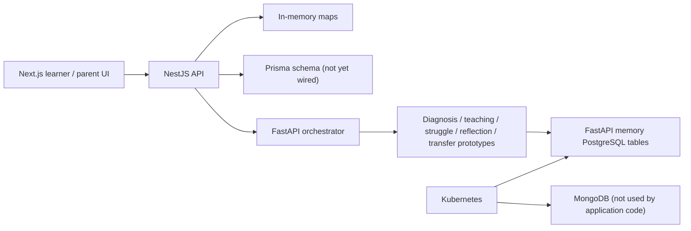
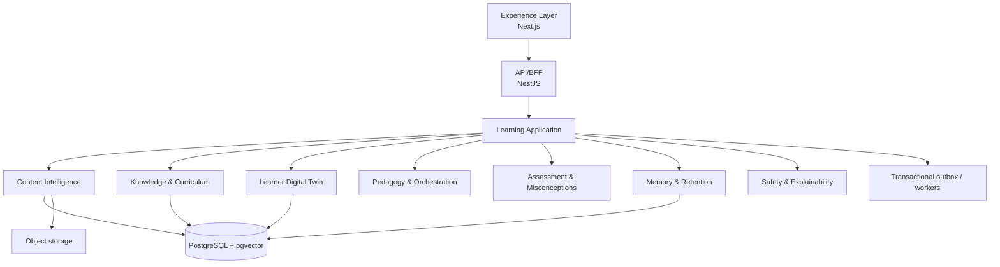

# EKAGURU Architecture V2 — Phase 1A Audit

Date: 2026-08-10  
Branch: `architecture-v2`

## Executive decision

EKAGURU should evolve as a modular learning application, not as eight independently deployed cognitive services. The Next.js frontend and NestJS backend form the best MVP foundation. The existing Python services hold useful domain experiments, especially the cognitive state machine and optimistic learner-state updates, but should be merged behind explicit TypeScript domain boundaries before production use.

## Current inventory

| Area | Current implementation | Decision |
| --- | --- | --- |
| Learner UI | Next.js 14, TypeScript, Tailwind, learner, tutor and parent routes | **KEEP + REFACTOR** |
| API/BFF | NestJS 10 with upload, tutor, parent, session, auth, health and metrics endpoints | **KEEP + REFACTOR** |
| Knowledge model | Prisma PostgreSQL schema for subjects, topics, concept atoms and relations | **KEEP + REPLACE MODEL** |
| Content ingestion | PDF parsing, OCR and visual-analysis scaffolding in `BookService` | **KEEP + REFACTOR** |
| Learning loop | NestJS session fallback plus Python FSM | **MERGE** |
| Diagnosis | Python keyword heuristics | **REPLACE** |
| Teaching/struggle/reflection/transfer | Separate FastAPI prototypes | **MERGE** |
| Learner memory | FastAPI + SQLAlchemy state store and outbox | **MERGE** |
| Parent experience | NestJS parent API and Next.js dashboard | **KEEP + REFACTOR** |
| MongoDB | Kubernetes manifests and planning documents; no application use found | **REMOVE FROM CORE** |
| Runtime | Docker, Kubernetes manifests, Helm scaffold, monitoring manifests | **KEEP + CONSOLIDATE** |

## Current architecture

## Architecture V2 target

## Required data migration

1. Establish one PostgreSQL schema and migration history under the NestJS application.
2. Retain and reshape `ConceptAtom` and `ConceptRelation` into `Document → Chapter → Topic → Concept → Relationship`.
3. Add learner evidence, interventions, misconceptions, retention schedules, source citations and outbox events.
4. Add `pgvector` only after the document/chunk ownership model exists.
5. Migrate or retire the Python memory tables only after imports and consumers have been identified. MongoDB is not a core data store.

## Immediate risks

1. **Critical:** an API key was committed in `.env.example`. It has been removed from the example, but the key must be revoked/rotated and repository history should be remediated separately.
2. **Critical:** authentication accepts any non-empty password, creates a parent account during login, and has a production JWT fallback secret. Child and parent endpoints are not consistently protected.
3. **High:** 41 uploaded PDFs and 97 Next.js build files are tracked. They must be reviewed as possible personal/content data and removed in a deliberate, separately verified change.
4. **High:** learner state and sessions reside in process memory; restarts lose data and concurrent instances diverge.
5. **High:** production behavior can silently fall back to mocked AI and deterministic session transitions.
6. **Medium:** unrestricted CORS, no request DTO validation, no verified readiness dependency checks, and generic Kubernetes deployment manifests reduce production safety.

## Phase 1 implementation backlog

1. Rotate the exposed provider key; then clean it from Git history using a planned security procedure.
2. Enforce configuration validation, remove default JWT secrets and mock authentication, and protect parent/child resources.
3. Introduce the Architecture V2 NestJS module boundaries and persistence abstraction.
4. Add database migrations for the material, concept, learner-evidence and session-event foundations.
5. Implement the new frontend application shell and routes: `/learn`, `/library`, `/library/add`, `/knowledge-map`, `/learn/[concept]`, `/growth`, and `/parent/dashboard`.
6. Replace in-memory state with PostgreSQL persistence and an outbox.
7. Fold the Python prototype logic into tested domain services; retain standalone workers only when processing needs isolation.
8. Remove tracked runtime artifacts and MongoDB manifests only after a dependency review and data disposition approval.
