# EKAGURU page teaching architecture review

Reviewed 10 September 2026. Repository-wide architecture trace, with detailed inspection of the executable textbook-to-board path. This is not certification of every source line or deployment.

## Approved interface constraint

The user confirmed the existing library and Guru classroom designs as the implementation baseline. See [approved interface architecture and screenshots](approved-interface-architecture.md). Preserve those screens and integrate the new source-grounded runtime into them. PageGroundedStudio now combines its source/session controller with the approved textbook sidebar, purple depth selector, wood-framed green board, resource tabs and question bar. All normal Open Book routes use this shell; a preview query is no longer required.

## Finding

The previous learner screen was a demonstration disconnected from the extraction and session systems. A scan on the left and a page number in generated prose did not establish that the Guru was teaching that scan. Multiple systems called themselves canonical, but there was no enforced source identity across them.

This change replaces the disconnected demo path with source-backed extraction, a validated multimodal lesson-planning boundary, progressive board actions and durable server-assessed page sessions. Live model quality, canonical mastery mapping and broad production readiness remain explicitly unverified or unfinished.

## Repository architecture

| Area | Actual responsibility |
| --- | --- |
| universal/frontend | Next.js 14 / React: library, studio, session screens, parent dashboard, observe UI, local learning engines and browser storage. |
| universal/backend | NestJS API on port 20000; Prisma, authentication, uploads/extraction, canonical concepts, curriculum, mastery, sessions and observability. The main application backend, although the root README primarily describes Python services. |
| cognitive_services | Eight FastAPI services: memory, orchestration, diagnosis, teaching, struggle, reflection, transfer and parent analytics. Nest CognitiveLoopService calls the Python orchestrator and also has an in-memory fallback. This loop does not drive the previous textbook board. |
| backend/src/domain and backend/src/ai | Earlier domain and AI APIs, Gemini LlmService, vision, WebSockets, session recording and the cognitive-loop bridge. Coexist with learning-library v2. |
| backend/src/learning-library | Learners/materials/documents, storage, extraction, knowledge/alignment/curriculum, mastery/evidence, session orchestration and personalization. Some additional controllers/services exist without registration in LearningLibraryModule. |
| frontend/lib/learning | Another family of document, knowledge, content-factory and learning-loop implementations. Several use local deterministic templates. They are not the backend database. |
| docs, scripts, kubernetes, .github | Product plans, milestone verification, operational manifests and CI. Passing milestone fixtures do not demonstrate the live page-to-board path. |

## Previous pipeline and concrete breaks

1. **Page opening:** both learning routes rendered UniversalKnowledgeUniverseStudio. The library page contained over 11,000 lines, mainly an embedded EVS manifest. It passed section text and printed-page metadata but omitted bookId. The studio ignored the supplied description and printed page. BookStorageService and the studio imposed EVS-derived chapters and a minimum of 116 pages.
2. **Source display:** BookPageViewer mapped arbitrary book IDs to keyword-matched folders, defaulted to EVS, and replaced failed non-EVS scans with EVS. Highlights assumed 1200 × 1680 dimensions. The actual tested EVS page 46 measures 1389 × 1964.
3. **Extraction:** ExtractionOrchestratorService calls format extractors, structure detection, semantic boundaries, knowledge construction, relationships and canonical projection. It persisted only the first 1,000 characters of each DocumentPage. The PDF extractor heuristically splits native text; scanned/unparseable input calls recoverAuthoritativeCurriculumDocument with a hard-coded 118-page curriculum. That recovery is not evidence of the uploaded PDF and is bypassed by the new board path.
4. **Knowledge models:** backend KnowledgeConstructorService and CanonicalModelService preserve concept/block/page provenance. In contrast, frontend SemanticKnowledgeExtractor in page-knowledge-model.ts constructs public-service entities and five depth plans regardless of rawText. The export_page_teaching_artifact.js script repeats this template, so its output is not an independent grounding check.
5. **Teaching packages:** GuruTeachingEngine uses the EVS table of contents, caches only page/depth, and fabricates fixed bounding boxes with confidence 0.99. LivingGuruAdapter does not execute its seventeen phases; it special-cases pages 44–47 and 73 and otherwise teaches germination/growth. Several depths collapse to basis. Other artifact tabs use local chapter templates too.
6. **Backend runtime:** TutorOrchestratorService operates on session curriculum concepts, with evaluation and mastery evidence. PedagogicalContextAssemblerService reads one concept source chunk and may fall back to a definition. Neither binds the opened book/page to board actions. UniversalLearningLibraryController reads only the first chapter page through an absolute E: path with generic concept names; it is not registered in LearningLibraryModule.
7. **Board execution:** LivingGuruBlackboard reveals emoji cards on a 4.2-second timer, labels every connector growth, and separately starts speech. Timers can outrun narration. It fabricates an EVS citation, increments local mastery by 0.52 for a correct option, and announces BKT confirmation without a supporting evidence transaction.

More animations or additional phase names alone cannot fix these disconnects.

## Target architecture

```mermaid
flowchart LR
  Source[Original source and immutable page identity] --> Extraction[Page extraction and quality review]
  Extraction --> Evidence[Versioned blocks and visual objects with coordinates]
  Evidence --> Knowledge[Page-scoped concepts and supported relations]
  Learner[Learner mastery, age, language and misconceptions] --> Planner[Pedagogical lesson planner]
  Knowledge --> Planner
  Planner --> Gate[Evidence and action-schema validation]
  Gate --> Runtime[Teaching state machine]
  Runtime --> Board[Progressive scene and narration]
  Board --> Response[Learner response]
  Response --> Evaluator[Server assessment and misconception evaluation]
  Evaluator --> Ledger[Idempotent evidence ledger]
  Ledger --> Learner
  Evaluator --> Runtime
```

Source identity must include material/book ID, source revision/hash, physical PDF page or explicitly named scan index, optional printed label, image hash, dimensions and rotation. Split spreads need explicit crop/side mappings. Printed page and PDF page must not be silently interchanged.

PageEvidence contains ordered blocks and visual objects with source coordinates and extraction quality. OCR confidence measures recognition quality, not factual truth. Rejected regions remain visible and require review. Knowledge should reference the active page; cross-page prerequisites need explicit labels.

Lesson plans need objectives, learner level, evidence-linked concepts, explanations, drawing primitives, prompts, expected evidence and remediation branches. Typed board commands should cover writing, drawing, connections, highlighting, explanations, questions, waits, erasing and summaries. The runtime owns animation/speech completion, input waits, pause/resume, cancellation and persistent scene state.

Mastery belongs to the backend ledger. Playback completion, recall and assessed explanation are different events. Higher levels must change support, vocabulary, granularity, reasoning demand and assessment—not just a badge.

## Implemented architecture

### Source extraction
- Exact book/material ID and physical page are carried from routes to source and board. No fallback to another book.
- PDF.js preserves actual page boundaries, measured text coordinates and file checksums. Unreadable PDFs fail explicitly; the synthetic 118-page recovery implementation is removed.
- Ingestion streams the original through StorageService into an isolated temporary file, then removes that staging file. It no longer assumes a local uploads directory.
- Native PDF text runs are reconstructed by a shared measured-coordinate extractor. Scans use automatic Tesseract page layout and configurable OCR_LANGUAGES (default eng). The fixed 550-pixel column split is removed.
- Full DocumentPage text, evidence blocks, page quality and source hash are persisted. Old synthetic records are not automatically repaired.
- Public scans are allowlisted. Private material routes enforce authentication and learner ownership, including mismatched learner/material parameters. Production demo-parent bypass is disabled.
- A bounded page cache keys book, physical page and image hash. Low-confidence lines are omitted and visibly counted.

### Page knowledge and pedagogical planning
There are two explicit modes:
1. Source reading remains available without model credentials. It compiles reliable excerpts, literal source relations, five scaffolding policies, recall and reflection.
2. Guru mode uses a configurable Gemini vision/reasoning adapter. It interprets instructional regions, plans explanations, examples, equations/tables and schematic drawings, then performs a separate source-review model pass.

Guru plans contain objectives, narration, evidence anchors, normalized drawing primitives, explanation questions and server-held rubrics. All actions must reference known evidence; every interpreted region must be covered; a complete explanation/drawing/checkpoint/summary cycle is required. Arbitrary executable markup and out-of-bounds shapes are rejected. Rubrics and expected answers are stripped from the public lesson.

The model review is a useful additional filter, not independent proof of factual accuracy. Model-estimated highlighting is labelled. Live teaching quality is not validated until model credentials and evaluation fixtures are supplied.

### Teaching runtime
- PageGroundedStudio owns one active source revision and rejects stale book/page/hash/preference responses.
- Five levels, teaching language and optional age condition lesson generation. Existing uploaded-material mastery suggests an initial level; the learner can override it.
- PageTeachingBoard coordinates progressive writing, SVG primitives, speech completion, pause/back/next/restart, speed and reduced motion.
- Saved sessions resume the same versioned lesson. Checkpoints block advancement; answers are evaluated on the server against source and rubric. Uncertain judgments request review.
- Help records assisted practice and permits continuation without awarding independent mastery.
- GuruTeachingEvent uses request IDs, payload hashes and revision compare-and-swap in a database transaction. Network retries do not duplicate evidence.
- Canonical mastery updates remain deliberately separate: page response observations do not yet have verified canonical concept mappings. Playback never changes mastery.

### Database and APIs
Additive migration: universal/backend/prisma/migrations/20260910000000_guru_page_runtime/migration.sql.
It adds DocumentPage evidence/sourceHash and GuruLessonArtifact, GuruTeachingSession and GuruTeachingEvent.

API endpoints:
- GET /api/v2/textbooks/:bookId/pages/:page/evidence
- GET /api/v2/learning-materials/:materialId/pages/:page/evidence
- GET /api/v2/guru/capabilities
- POST /api/v2/textbooks/:bookId/pages/:page/lesson
- POST /api/v2/learning-materials/:materialId/pages/:page/lesson
- POST /api/v2/guru/lessons/:artifactId/sessions
- GET /api/v2/guru/sessions/:id
- POST /api/v2/guru/sessions/:id/events

The local database already had tables without Prisma migration history. After read-only schema inspection, only this additive SQL was applied successfully. Historical migrations were not replayed or falsely marked applied. Production rollout needs proper baselining of that pre-existing schema before migrate deploy; never run a reset to resolve this.

### Compatibility
Existing upload, material, concept, curriculum, mastery, student-session, dashboard and Python APIs remain. The old studio body remains unexported as a migration reference. The active routes use the new board. Background ingestion no longer generates synthetic recovery content. Database connection URLs are no longer printed by PrismaService startup logging.

The former generated tabs currently provide page excerpts/reflections/notes; they are not six independently generated lesson artifacts.

## Additions on 11 September 2026

- Per-account model budgets (`GuruUsageService`), reported through `/api/v2/guru/capabilities` and `/api/v2/guru/usage`.
- Curator-verified concept mappings (`GuruConceptMapping`) and the gated mastery bridge (`GuruMasteryBridgeService`), the only path from page checkpoints to `LearningEvidence`. Disabled by default and additionally gated by an educator-approved evaluation corpus per depth and language.
- Educator evaluation corpus (rubric v1, `GuruEvaluationCase`/`GuruEvaluationReview`, `/api/v2/guru/evaluation`, `/admin/guru-evaluation`).
- Account recovery and email verification (`ParentRecoveryToken`, `credentialVersion` session revocation, `/login/recovery`).
- The demonstration studio body and fabricated engines listed under "Previous pipeline" items 4, 5 and 7 have been deleted from the frontend.

Operating details: guru-quality-and-mastery-gates.md. Evidence: ekaguru-implementation-plan.md.

## Remaining release requirements

These are tracked requirements, not claims of completed implementation:
- Configure GEMINI_API_KEY and GURU_MODEL; run real vision, explanations, diagrams and grading evaluations across subjects, ages and languages. There is no provider key configured in this workspace.
- Prepare and score the educator evaluation corpus (infrastructure now exists; no lesson has been generated or scored because no provider key is configured). A second call to the same model does not replace educator review.
- Re-extract affected legacy documents and verify concept mappings per lesson before enabling the mastery bridge (`GURU_MASTERY_BRIDGE=enabled`). Built-in scans have no extraction provenance and need manual curator links. Add a learner selector for shared parent accounts and builtin books.
- Durable queued lesson generation and per-user budgets are implemented (11 September 2026). Still needed before broad deployment: queued OCR for uploads, a distributed page-evidence cache (the current one is per process), client-initiated cancellation of jobs, and load tests.
- Add human extraction review/correction, verified semantic chapter manifests, prerequisite retrieval and general doubt-driven branching.
- Extend board source rendering beyond PDFs/images. Existing DOCX/EPUB/text ingestion remains, but those formats do not yet have trustworthy physical-page board renderers.
- Add broader UI localization, tested speech voices, right-to-left diagram layout, offline teaching packs and accessibility audits.
- Resolve the legacy Socratic API/test contract mismatch detailed in the validation report.

Global uniqueness and “best in the world” require comparative evidence and demonstrated learner outcomes. They are product ambitions, not assertions justified by this implementation.

## Operation

Run from universal/backend or set TEXTBOOK_SCAN_DIR. For offline OCR, TESSDATA_DIR must contain the language files named in OCR_LANGUAGES. Configure model secrets in the backend environment, never in NEXT_PUBLIC variables. GURU_MODEL must be a vision/JSON-capable model available to the configured Gemini account; no obsolete model name is silently selected.

See universal/backend/guru.env.example for the configuration names. Restart the backend after configuring them. Sign in, open /library/evs-class-5?page=46 or /library/<actual-material-id>?page=2, select the level/language, then choose Teach with Guru. Source reading remains available when reasoning is unavailable.

Verification commands from universal/backend:

~~~powershell
$env:TESSDATA_DIR='E:/Ekaguru'
node scripts/verify_page_evidence.js evs-class-5 46
node scripts/verify_uploaded_page_evidence.js
node scripts/verify_guru_runtime.js
~~~

The database runtime script creates and removes only its own uniquely identified fixture artifact/session. It uses a deterministic model test double and does not make a live inference call.

## Local upload correction

The approved library previously saved metadata only and advanced simulated extraction stages on timers. It never retained the PDF, and arbitrary IDs inherited EVS chapters. The upload now validates and stores the original PDF in IndexedDB, obtains its real page count with PDF.js and renders the requested physical page with native text evidence. Old metadata-only entries require their original PDF to be reattached; no source substitution is permitted. Local scanned pages remain visible but need OCR/model interpretation before teaching. Cloud model reasoning for locally stored PDFs requires an authenticated upload bridge, tracked separately.
