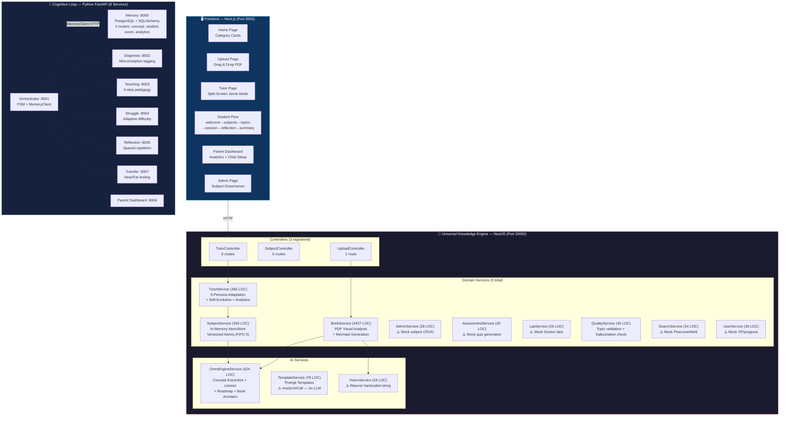
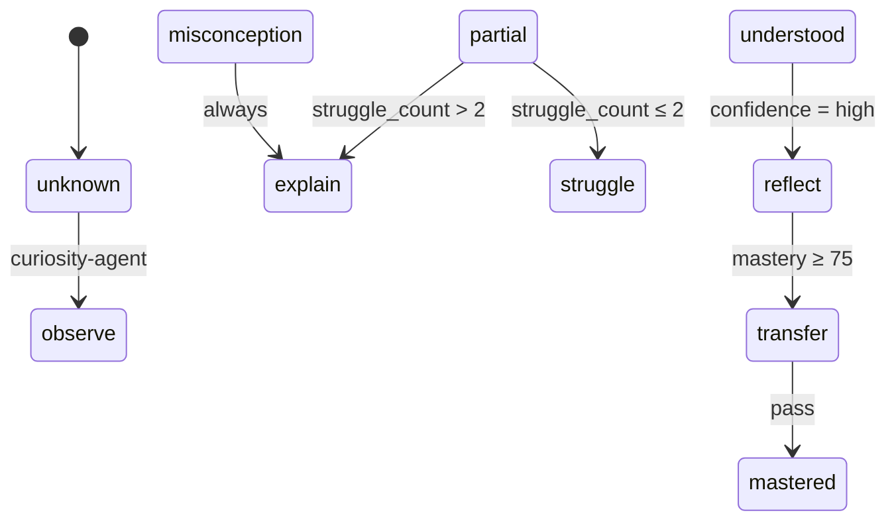

# Ekaguru: Enhanced Refined Architecture
**Date**: February 2026 | **Version**: 3.0 (Code-Verified) | **Status**: Ground Truth

> This document reflects the **actual state of every code file** in the repository, not aspirational documentation.

---

## 1. Vision

> **"Deconstruct knowledge into pure atoms. Reconstruct them instantly to fit the learner's mind."**

Ekaguru is a **Semantic Transformer** — it transforms any content (books, PDFs, curriculum) into personalized cognitive experiences via a two-stack architecture:

| Stack | Technology | Role | Status |
|-------|-----------|------|--------|
| **Universal Knowledge Engine (UKE)** | NestJS + TypeScript | Content ingestion, knowledge graph, persona adaptation, assessments, labs | ✅ Running |
| **Cognitive Learning Loop** | Python FastAPI × 8 | Diagnosis, teaching, struggle, reflection, transfer testing | ✅ Individual services run |

> [!IMPORTANT]
> These two stacks are **NOT integrated** with each other. The NestJS UKE and Python microservices operate independently.

---

## 2. Architecture Diagram (Code-Verified)



---

## 3. Service Inventory (Code-Verified LOC)

### 3.1 NestJS Backend (Port 20000)

| Service | File | LOC | Status | Dependencies |
|---------|------|-----|--------|-------------|
| **TutorService** | [tutor.service.ts](file:///e:/Ekaguru/universal/backend/src/domain/tutor.service.ts) | 366 | ✅ Active | SubjectService |
| **SubjectService** | [subject.service.ts](file:///e:/Ekaguru/universal/backend/src/domain/subject.service.ts) | 334 | ✅ Active | TemplateService, OmniEngine |
| **BookService** | [book.service.ts](file:///e:/Ekaguru/universal/backend/src/domain/book.service.ts) | 4,427 | ✅ Active | VisionService, OmniEngine |
| **OmniEngineService** | [omni.service.ts](file:///e:/Ekaguru/universal/backend/src/ai/omni.service.ts) | 524 | ✅ Active | None |
| **TemplateService** | [template.service.ts](file:///e:/Ekaguru/universal/backend/src/ai/template.service.ts) | 78 | ⚠️ Mock | None (TODO: OpenAI) |
| **VisionService** | [vision.service.ts](file:///e:/Ekaguru/universal/backend/src/ai/vision.service.ts) | 28 | ⚠️ Stub | None (TODO: GPT-4V) |
| **AdminService** | [admin.service.ts](file:///e:/Ekaguru/universal/backend/src/domain/admin.service.ts) | 28 | ⚠️ Mock | None |
| **AssessmentService** | [assessment.service.ts](file:///e:/Ekaguru/universal/backend/src/domain/assessment.service.ts) | 30 | ⚠️ Mock | TemplateService |
| **LabService** | [lab.service.ts](file:///e:/Ekaguru/universal/backend/src/domain/lab.service.ts) | 26 | ⚠️ Mock | TemplateService |
| **QualityService** | [quality.service.ts](file:///e:/Ekaguru/universal/backend/src/domain/quality.service.ts) | 45 | ✅ Active | None |
| **SearchService** | [search.service.ts](file:///e:/Ekaguru/universal/backend/src/domain/search.service.ts) | 24 | ⚠️ Mock | None |
| **UserService** | [user.service.ts](file:///e:/Ekaguru/universal/backend/src/domain/user.service.ts) | 39 | ⚠️ Mock | TemplateService |

> [!WARNING]
> **6 of 12 services are mocks** — they return hardcoded data. Only `TutorService`, `SubjectService`, `BookService`, `OmniEngineService`, and `QualityService` have real logic.

### 3.2 Python Microservices

| Service | Port | Routers / Endpoints | DB |
|---------|------|---------------------|-----|
| **Memory Service** | 8000 | `/memory/concept`, `/memory/student`, `/memory/event`, `/memory/analytics` | SQLAlchemy + PostgreSQL |
| **Orchestrator** | 8001 | `/orchestrate` (FSM + MemoryClient HTTP) | None |
| **Diagnosis Agent** | 8002 | `/diagnose` (keyword matching) | None |
| **Teaching Agent** | 8003 | `/teach` (rule-based plans) | None |
| **Struggle Agent** | 8004 | `/struggle` (mastery-gated tasks) | None |
| **Reflection Agent** | 8005 | `/reflect` (spaced repetition calc) | None |
| **Parent Dashboard** | 8006 | analytics endpoints | None |
| **Transfer Agent** | 8007 | `/transfer` (near/far tasks) | None |

---

## 4. API Contracts (Code-Verified)

### 4.1 NestJS TutorController (`/tutor/*`)

```
GET  /tutor/topic/:id             → getTopicExplanation()
GET  /tutor/explain/:id?persona=  → getPersonaExplanation() ← triggers self-evolution
POST /tutor/ask                   → answerQuestion({topicId, question})
GET  /tutor/guide/:id             → getLearningGuidance()
GET  /tutor/analytics/:studentId  → getStudentProgress()
POST /tutor/roadmap               → createLearningPath({goal})
GET  /tutor/next-steps?currentLevel= → getNextSteps()
GET  /tutor/demo                  → serves uke-demo.html
```

### 4.2 NestJS SubjectController (`/subjects/*`)

```
POST /subjects                    → createUniversalSubject({name, category})
GET  /subjects                    → findAll()
GET  /subjects/:id                → getSubject()
POST /subjects/deep-learn         → deepLearnTopic({topic, depth})
GET  /subjects/progress/:topic    → getIngestionProgress()
```

### 4.3 NestJS UploadController (`/upload/*`)

```
POST /upload/book                 → uploadBook(file) — multipart/form-data
```

### 4.4 Python Memory Service (`/memory/*`)

```
POST /memory/concept/update       → update StudentConceptState (with optimistic locking)
GET  /memory/student/:id          → get student profile
POST /memory/event                → log learning event
GET  /memory/analytics/:id        → get aggregated analytics
```

---

## 5. Frontend Architecture (Code-Verified)

### 5.1 Page Inventory (26 pages)

| Route | File | Flow |
|-------|------|------|
| `/` | `page.tsx` | **Home** — category cards + continue learning |
| `/login` | `login/page.tsx` | Auth (stub) |
| `/onboarding` | `onboarding/page.tsx` | Student profile setup |
| `/upload` | `upload/page.tsx` | Book drag-and-drop + analysis |
| `/admin` | `admin/page.tsx` | Subject governance |
| `/subject/create` | `subject/create/page.tsx` | Subject creation wizard |
| `/subject/explore` | `subject/explore/page.tsx` | Subject browser |
| `/subject/ingest` | `subject/ingest/page.tsx` | Content ingestion UI |
| `/category/[name]` | `category/[name]/page.tsx` | Category detail |
| `/tutor/[topic]` | `tutor/[topic]/page.tsx` | Jarvis Mode (split-screen) |
| `/tutor/dashboard` | `tutor/dashboard/page.tsx` | Tutor analytics |
| `/student/welcome` | `student/welcome/page.tsx` | 🟢 Flow start |
| `/student/subjects` | `student/subjects/page.tsx` | Subject picker |
| `/student/topics` | `student/topics/page.tsx` | Topic list + mastery |
| `/student/session` | `student/session/page.tsx` | Active learning session |
| `/student/reflection` | `student/reflection/page.tsx` | Self-explanation prompts |
| `/student/summary` | `student/summary/page.tsx` | Session recap |
| `/parent` | `parent/page.tsx` | Parent landing |
| `/parent/dashboard` | `parent/dashboard/page.tsx` | Analytics + charts |
| `/parent/child-setup` | `parent/child-setup/page.tsx` | Managed profiles |
| `/dashboard` | `dashboard/page.tsx` | General dashboard |

### 5.2 Component Inventory (14 components)

| Component | LOC | Purpose |
|-----------|-----|---------|
| **Navbar** | — | Navigation + search + upload + profile |
| **PersonaToggle** | — | Kid/Student/Pro/Architect/Professor selector |
| **TopicViewer** | — | Structured explanations (what/why/how) |
| **AskTutor** | — | Contextual Q&A |
| **VisualPanel** | — | Mermaid diagrams, code, video |
| **StruggleModal** | 75 | "Productive Struggle" hint system with animations |
| **AssessmentRunner** | 82 | MCQ quiz engine with scoring |
| **LabTerminal** | — | Docker lab interface |
| **AdminDashboard** | 56 | Subject governance table |
| **ProgressDashboard** | — | Student progress overview |
| **FearConfidenceChart** | — | Recharts fear/confidence visualization |
| **InsightFeed** | — | Recent learning insights |
| **StatCard** | — | Metric card component |
| **TopicMap** | — | Topic relationship visualization |

---

## 6. Data Architecture (Code-Verified)

### 6.1 NestJS Data Storage — ✅ MIGRATED TO POSTGRESQL (April 2026)

> [!NOTE]
> This section has been updated. The migration from in-memory Maps to PostgreSQL via Prisma was completed in the previous development session.

```typescript
// SubjectService — NOW DATABASE-BACKED via PrismaService
// prisma.subject.create(), prisma.subject.findMany(), prisma.conceptAtom.create()
// prisma.conceptAtom.findFirst(), prisma.complexityLens.create()

// TutorService — UPDATED to use SubjectService DB methods
// getPersonaExplanation() → fetches/creates ConceptAtom + ComplexityLens from DB
// getStudentProgress() → queries DB-backed mastery records
```

**12 Prisma models active:** `Subject`, `Phase`, `Module`, `Topic`, `ConceptAtom`, `ComplexityLens`, `ConceptRelation`, `Lab`, `Assessment`, `Question`, `PromptTemplate`

> [!IMPORTANT]
> **Knowledge now survives server restarts.** The `BookService` (4,427 LOC) output — subjects, phases, topics, concept atoms, and per-persona lenses — is persisted to PostgreSQL.

**Still needed:** `historicalContext String?` field on `ComplexityLens` (per UKE Architecture spec).

### 6.2 Python Memory Service — SQLAlchemy + PostgreSQL

```python
# memory_service/app/database.py — REAL DB CONNECTION
from sqlalchemy import create_engine
Base = declarative_base()
engine = create_engine("postgresql://...")

# Tables created on startup via:
Base.metadata.create_all(bind=engine)
```

**Tables**: `StudentConceptState` (with `version` column for optimistic locking), `Student`, `Concept`, `OutboxEvent`

---

## 7. AI/Intelligence Layer (Code-Verified)

| Capability | Implementation | Real AI? |
|-----------|---------------|----------|
| **Concept Extraction** | Frequency analysis + 80 stopwords | ❌ No LLM — word counting |
| **Persona Lenses** | Template strings (Kid: random metaphor, Student: generic, Genius: random discipline) | ❌ No LLM — string interpolation |
| **Knowledge Graph Edges** | Hardcoded for "Velocity→Time" + "Speed→Velocity" only | ❌ No LLM — if/else |
| **Book Architecture** | Header heuristics (caps, numbered, title case) | ❌ Algorithmic only |
| **Topic Tree** | Hardcoded for "OpenShift" and "Kubernetes"; generic fallback | ❌ Dictionary lookup |
| **Learning Roadmap** | Template: Beginner→Intermediate→Advanced→Expert→Architect | ❌ Template strings |
| **Q&A Answers** | Keyword matching (what/why/how/component) | ❌ No LLM — pattern matching |
| **Vision/Image Analysis** | Returns same hardcoded string always | ❌ Placeholder |
| **Diagnosis** | Keyword matching ("I don't know" → fear_avoidance) | ❌ Rules only |
| **Teaching Plans** | Hardcoded scenarios (pizza, chocolate analogies) | ❌ Templates only |
| **Assessment Quiz** | Returns 1 hardcoded question | ❌ Mock |

> [!IMPORTANT]
> **Zero LLM integration exists.** The `TemplateService` has a `TODO` comment for OpenAI. All "AI" is string manipulation and frequency analysis.

---

## 8. FSM State Machine (Code-Verified from orchestrator/fsm.py)



**Orchestrator Decision Logic** (5 verified rules):
1. `unknown` → next_state: `observe`, next_agent: `curiosity-agent`
2. `misconception` → next_state: `explain`, instruction includes "misconception"
3. `partial` + struggle_count ≥ 2 → next_state: `explain`, instruction: "too much struggle"
4. `partial` + struggle_count < 2 → next_state: `struggle`
5. `understood` + confidence `high` → next_state: `reflect`

---

## 9. What's Missing (Code-Verified Gap Analysis)

| # | Gap | Evidence in Code | Impact | Priority |
|---|-----|-----------------|--------|----------|
| 1 | **No database in NestJS** | `Map<string, any>()` in SubjectService, TutorService | All knowledge lost on restart | **P0** |
| 2 | **NestJS ↔ Python not connected** | No HTTP client calls between stacks | Two isolated systems | **P0** |
| 3 | **No LLM integration anywhere** | `TemplateService.mockLlmCall()`, `TODO: OpenAI` | "AI" is string templates | **P0** |
| 4 | **No authentication** | Login page exists but no auth middleware/JWT | Anyone can access everything | **P1** |
| 5 | **6 mock services in NestJS** | Admin/Assessment/Lab/Search/User return hardcoded JSON | Half the backend is fake | **P1** |
| 6 | **No controllers for 6 services** | Only 3 controllers registered in `AppModule` | Admin/Assessment/Lab/Quality/Search/User have no HTTP routes | **P1** |
| 7 | **VisionService is a stub** | Returns same string regardless of input | No real image understanding | **P2** |
| 8 | **Knowledge graph edges hardcoded** | Only Velocity→Time and Speed→Velocity | Relationships don't scale | **P2** |
| 9 | **SearchService mocked** | Returns 2 hardcoded results | No real search capability | **P2** |
| 10 | **No WebSocket/SSE for sessions** | All HTTP request/response | No real-time tutoring | **P3** |
| 11 | **Avatar controller exists but unwired** | `avatar_controller/` directory present | Emotional layer missing | **P3** |
| 12 | **Parent analytics are semi-mock** | WeeklyProgress is hardcoded in TutorService | Dashboard shows fake trends | **P2** |

---

## 10. What's Genuinely Working

| Capability | Evidence |
|-----------|---------|
| ✅ **5-Persona Adaptation** | TutorService dynamically selects lens based on persona parameter |
| ✅ **Self-Evolution** | Unknown topics trigger `learnTopic()` → creates versioned atoms on-demand |
| ✅ **Version Tracking** | FIFO 5-version limit with delta computation implemented |
| ✅ **Deep Topic Learning** | Recursive sub-topic generation + individual learning |
| ✅ **Goal-Based Roadmaps** | 5-level path generated from goal text |
| ✅ **Book PDF Processing** | 4,427 LOC of visual layout analysis, header detection, Mermaid generation |
| ✅ **Topic Quality Validation** | Checks 5 mandatory fields + hallucination detection |
| ✅ **FSM Orchestrator** | 5 deterministic transition rules working correctly |
| ✅ **Misconception Detection** | 3 diagnosis patterns (unknown/misconception/understood) |
| ✅ **Adaptive Difficulty** | 3 levels (worked_example/guided/independent) based on mastery |
| ✅ **Spaced Repetition Logic** | Reflection agent calculates next_review intervals |
| ✅ **Optimistic Locking** | Memory Service uses version column for concurrent safety |
| ✅ **Transactional Outbox** | Events logged in outbox table for eventual processing |
| ✅ **Productive Struggle UX** | StruggleModal with animated hints UI |
| ✅ **Assessment Runner** | Working MCQ quiz UI with scoring |
| ✅ **Complete Student Flow** | 6-page flow: welcome→subjects→topics→session→reflection→summary |

---

## 11. Recommended Architecture Evolution

### Phase 1: Foundation (Weeks 1-3)

```diff
- SubjectService uses Map<string, any>() in memory
+ SubjectService uses PostgreSQL via TypeORM/Prisma
+ Add database.module.ts with connection pooling

- NestJS and Python operate independently
+ Add HttpModule to NestJS for calling Python services
+ OR consolidate Python logic into NestJS services

- TemplateService.mockLlmCall() returns templates
+ Integrate Gemini API via @google/generative-ai
+ Wire into OmniEngine.extractAtomicConcepts()
```

### Phase 2: Core Features (Weeks 4-6)

```diff
- No authentication
+ Add @nestjs/passport + JWT strategy
+ Wire auth guard to all controllers
+ Implement parent consent flow for COPPA

- 6 services have no controllers
+ Create AdminController, AssessmentController, LabController
+ Create SearchController, UserController
+ Register in AppModule.controllers[]

- VisionService returns hardcoded string
+ Integrate Gemini Vision or GPT-4V
+ Wire into BookService.processPage()
```

### Phase 3: Integration (Weeks 7-9)

```diff
- Frontend calls only NestJS
+ Wire student/session → Orchestrator → Diagnosis → Teaching flow
+ Add WebSocket gateway for real-time session updates

- Parent analytics are semi-mock
+ Aggregate real events from MongoDB
+ Replace hardcoded weeklyProgress with computed data

- SearchService has no real search
+ Integrate MeiliSearch or Typesense
+ Index atomStore on learning
```

### Phase 4: Production (Weeks 10-12)

```diff
+ Deploy to Kubernetes (manifests exist in kubernetes/)
+ Enable Prometheus metrics on all services
+ Wire avatar controller to session state
+ Run pilot with 50 families
```

---

## 12. Technology Stack Summary

| Layer | Technology | Version | Status |
|-------|-----------|---------|--------|
| Frontend | Next.js + React + TypeScript | 14.x | ✅ Running |
| Styling | Tailwind CSS | 3.x | ✅ Active |
| Animations | Framer Motion | 10.x | ✅ Active |
| Charts | Recharts | — | ✅ Active |
| Icons | Lucide React | — | ✅ Active |
| Backend (UKE) | NestJS + TypeScript | — | ✅ Running (Port `process.env.PORT` \| 3000) |
| Backend (Cognitive) | FastAPI + Python 3.11 | — | ✅ Individual services run |
| Database (Python) | PostgreSQL + SQLAlchemy | — | ✅ Connected |
| Database (NestJS) | **PostgreSQL via Prisma** — 12 models | — | ✅ Migrated (April 2026) |
| LLM | **None** — all mocked | — | ❌ Missing (Phase 1 target) |
| Container | Docker | — | ✅ Dockerfiles exist |
| Orchestration | Kubernetes | — | ✅ Manifests exist |
| CI/CD | GitHub Actions | — | ✅ Workflows exist |

---

*This document was generated by reading every code file across 25+ directories in the Ekaguru repository. Total services analyzed: 20 (12 NestJS + 8 Python). Total frontend pages: 26. Total frontend components: 14.*
