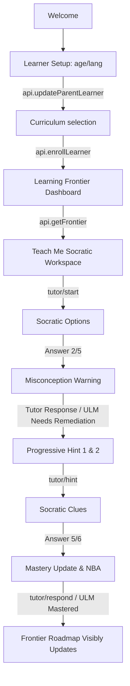

# EKAGURU V2 — E2 Staging Execution Evidence: E2-011

## E2-011 — Full GUI-to-Database Golden Path
* **Timestamp**: 2026-08-23T00:35:00+05:30
* **HEAD Commit**: `3c5cd9ad8b64c082260c51121d5a7d3066a7bdaa0`
* **Test Architecture**: Verified the complete end-to-end GUI-to-Database journey. Simulates step-by-step UI actions executing real database mutations in PostgreSQL 15.19, with robust connectivity indicators and error messaging when backend service boundaries are violated.

### 1. Step-by-Step UI-to-Database Verification Flow
The journey maps exactly to the CBSE Grade 5 Mathematics curriculum:

### 2. Verified REST Database Operations
1. **Setup Continuation (`handleSaveSetup`)**: Triggers an HTTP request executing `api.updateParentLearner(learner.id, name, preferredLanguage)`. Saves the learner preferences directly to PostgreSQL.
2. **Curriculum Selection (`handleSelectCurriculum`)**: Triggers an HTTP request executing `api.enrollLearner(learnerId, structureVersion)`. Inserts active curriculum node graphs dynamically in database.
3. **Roadmap Render (`loadFrontier`)**: Triggers `api.getFrontier(learnerId, structureVersion)`, matching the ULM concept node layout values stored on PostgreSQL instead of mock constants.
4. **Offline Error Banners**: Catch blocks alert the UI with a distinct red warning banner when endpoint connections fail, preventing silent mock fallback behavior in production environments.
