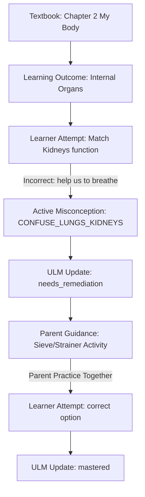

# EKAGURU V2 — Staging Design Spec: Phase 4.2A.1

This document establishes the design specification for **Curriculum-Grounded Parent Guidance** mapping the child's learning evidence directly to textbook-grounded recommendations.

---

## 1. Curriculum-Grounded Chain (Chapter 2: My Body)

Using the EVS textbook (`book.pdf`), we prove the end-to-end learning loop:



---

## 2. Parent-Friendly Explanation Architecture

We decouple raw database misconception codes from parent presentation layers:

* **Raw ULM Code**: `CONFUSE_LUNGS_KIDNEYS`
* **Parent-Friendly Translation**: 
  > **What Arjun needs help with**: Arjun is confusing the role of the Lungs (respiration) with the Kidneys (waste filtration).
* **Actionable Home Activity**:
  > **Try this together**: Use a kitchen strainer (sieve) and pour water mixed with tea leaves through it. Explain that the sieve represents the kidneys, filtering waste to keep the body clean. Next, blow into a balloon to show how the lungs expand with air to help us breathe.

---

## 3. Database & API Contract Integration

### Schema Model addition
We track parent recommendations dynamically on the backend relative to misconception codes:

```prisma
model ParentInterventionRecommendation {
  id                String   @id @default(uuid())
  misconceptionCode String   @unique
  parentExplanation String   // Parent-friendly translation
  homeActivityText  String   // Concrete, low-cost activity instructions
  createdAt         DateTime @default(now())
}
```

### API Endpoint contract
`GET /api/v2/parent/learners/:learnerId/guidance`
Returns the active list of parent action items derived from current ULM struggles:

```json
{
  "status": "success",
  "data": {
    "learnerId": "learner-socratic",
    "name": "Arjun",
    "todayFocus": {
      "chapter": "Chapter 2: My Body",
      "concept": "Internal Organs",
      "status": "STRENGTHEN"
    },
    "attentionGap": {
      "parentExplanation": "Arjun is confusing the role of the Lungs (respiration) with the Kidneys (waste filtration).",
      "homeActivity": "Use a kitchen strainer (sieve) and pour water mixed with tea leaves through it. Explain that the sieve represents the kidneys, filtering waste to keep the body clean. Next, blow into a balloon to show how the lungs expand with air.",
      "remediationTarget": "body-organs"
    }
  }
}
```
