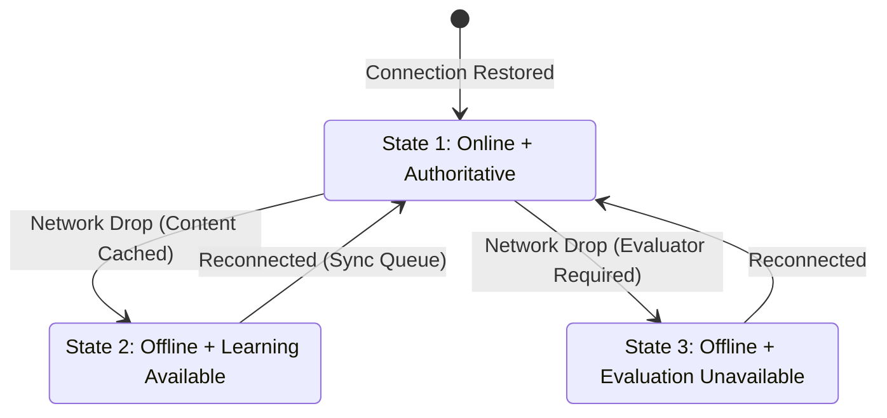

# EKAGURU V2 — E2 Staging Design Spec: E2-012

This document establishes the architectural framework for **E2-012 — Human Learning Experience Acceptance** and details the three-state offline connectivity model designed to support low-bandwidth learning.

---

## 1. E2-012 Human UX Acceptance Framework

To ensure that the technical correctness of the database/ULM matches real-world educational value, we evaluate the Golden Path across three human personas.

### Persona 1: The Learner ("I want to learn fractions")
* **Educational Objective**: Struggle safely without frustration; receive progressive support that resolves conceptual gaps.
* **UX Acceptance Flow**:
  1. **Visual Calibration**: Shows the learner their progress on the *Learning Frontier* roadmap.
  2. **Active Engagement**: Presents the Socratic question in their preferred language.
  3. **Safe Struggle & Hints**: Allows up to 3 tiers of progressive hints (Clue $\to$ Analogy $\to$ Symbolic Math) rather than immediate answers.
  4. **Misconception Remediation**: Triggers explicit, non-punitive amber warnings (`ADD_DENOMINATORS_DIRECTLY`) with conceptual guides.
  5. **Mastery Realization**: Celebration of mastery based on ULM validation, unlocking the next step.

### Persona 2: The Parent ("Is my child making progress?")
* **Educational Objective**: Trust that the platform is providing high-fidelity education, with clear insight into struggles.
* **UX Acceptance Flow**:
  1. **Concept Dashboard**: Shows active mastery levels (e.g., `0.35` $\to$ `0.87`).
  2. **Struggle Insights**: Clearly documents active misconceptions (e.g., "Arjun is adding denominators directly").
  3. **Actionable Suggestions**: Recommends parent-involvement prompts (e.g., "Cut a real pizza into unequal slices to show why we need common sizes").

### Persona 3: The Educator ("Who needs my intervention?")
* **Educational Objective**: Spot classroom-level trends and individual learning blockages.
* **UX Acceptance Flow**:
  1. **Classroom Mastery Mapping**: Aggregates ULM frontier positions.
  2. **Prerequisite Gaps**: Highlights missing foundational skills blocking advancement.
  3. **Targeted Interventions**: Recommends concrete teaching strategies based on active misconception codes.

---

## 2. Three-State Connectivity Model

To support underserved learners in low-bandwidth or remote environments, the client/server architecture supports three distinct connectivity states:

| State | Status | UI Indicator | Capability | Data Sync Strategy |
| :--- | :--- | :--- | :--- | :--- |
| **State 1** | Online + Authoritative | 🟢 Connected | Full read/write access. Every response graded live against PostgreSQL and ULM. | Standard REST API requests. Live transactional outbox. |
| **State 2** | Offline + Learning Available | 🟡 Offline | Read cached learning materials, watch offline videos, or practice questions locally. | Queue events (e.g., `STEP_VIEWED`, `READ_TIME`) in IndexedDB. Sync upon reconnection. |
| **State 3** | Offline + Evaluation Unavailable | ⚠️ Connection Required | Authoritative assessment grading and ULM master updates are frozen. | Do NOT evaluate locally. Prompt learner to reconnect to submit mastery challenges. |

---

## 3. Product Features value Gate

To preserve the sacred learning loop and prevent feature creep (gamification, leaderboards, cartoon badges), every future capability must be evaluated against the Educational Value Gate:

$$\text{High Educational Impact} + \text{High Reach} + \text{High User Value} + \text{Low/Manageable Complexity} = \text{BUILD}$$
