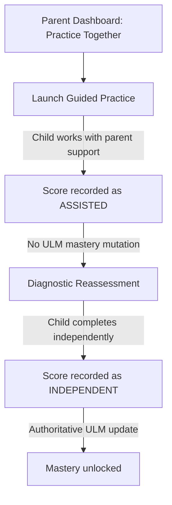

# EKAGURU V2 — Staging Design Spec: E2-013

This design specification details **E2-013 — Parent Intelligence & Curriculum Grounding Layer**, establishing the database models, API contracts, and architectural boundaries for curriculum-grounded parent interventions.

---

## 1. Curriculum Knowledge Layer (First-Class Book Models)

We establish the database schema mapping the book as a first-class object:

```prisma
// 1. Book Curriculum Object
model Book {
  id          String    @id @default(uuid())
  title       String
  edition     String
  board       String
  grade       Int
  subject     String
  chapters    Chapter[]
  createdAt   DateTime  @default(now())
}

// 2. Chapter Object
model Chapter {
  id               String            @id @default(uuid())
  bookId           String
  book             Book              @relation(fields: [bookId], references: [id], onDelete: Cascade)
  chapterNumber    Int
  title            String
  learningOutcomes LearningOutcome[]
  createdAt        DateTime          @default(now())
}

// 3. Learning Outcome Object
model LearningOutcome {
  id          String    @id @default(uuid())
  chapterId   String
  chapter     Chapter   @relation(fields: [chapterId], references: [id], onDelete: Cascade)
  description String
  concepts    Concept[]
  createdAt   DateTime  @default(now())
}
```

---

## 2. Parent-Child Evidence Separation Boundary

To protect the integrity of the Universal Learner Model (ULM):
* **Parent-Guided Practice**: Triggers learning loops but is marked as `ParentAssisted` in the database.
* **Mastery Updates**: Authoritative mastery score updates are only triggered by **Independent Child Attempts** (`provenance = INDEPENDENT`). Parent-assisted practices cannot mutate ULM mastery scores directly.



---

## 3. Three-Tier Presentation Layer

Every observed reasoning gap maps to three communication formats:

```json
{
  "internalCode": "CONFUSE_LUNGS_KIDNEYS",
  "educatorDescription": "Learner is confusing respiratory (Lungs) and excretory (Kidneys) organ functions.",
  "parentExplanation": "Arjun is mixing up what the lungs and kidneys do in the body.",
  "homeActivity": {
    "activityText": "Use a kitchen sieve and water with tea leaves to demonstrate the idea of filtering. Then explain that the kidneys perform a much more complex biological filtering function inside the body.",
    "scientificWarning": "Note: Explain to your child that this is a simple demonstration of filtering, not a literal representation of kidney physiology."
  }
}
```

---

## 4. Evidence Provenance & Explainable NBA API Contract

The `GET /api/v2/parent/learners/:learnerId/guidance` endpoint provides full explainable provenance metadata:

```json
{
  "status": "success",
  "data": {
    "learnerId": "learner-socratic",
    "name": "Arjun",
    "todayFocus": {
      "chapterId": "chap-evs-mybody",
      "chapterTitle": "Chapter 2: My Body",
      "concept": "Internal Organs",
      "status": "STRENGTHEN"
    },
    "recommendation": {
      "parentExplanation": "Arjun is mixing up what the lungs and kidneys do in the body.",
      "scientificWarning": "Note: Explain to your child that this is a simple demonstration of filtering, not a literal representation of kidney physiology.",
      "homeActivity": "Use a kitchen sieve and water with tea leaves to demonstrate the idea of filtering. Then explain that the kidneys perform a much more complex biological filtering function inside the body."
    },
    "provenance": {
      "conceptId": "concept-internal-organs",
      "learningOutcomeId": "lo-identify-organs",
      "misconceptionCode": "CONFUSE_LUNGS_KIDNEYS",
      "evidenceId": "ev-lungs-kidneys-001",
      "attemptCount": 2,
      "lastObservedAt": "2026-08-23T00:50:00Z",
      "confidence": 0.91
    }
  }
}
```
