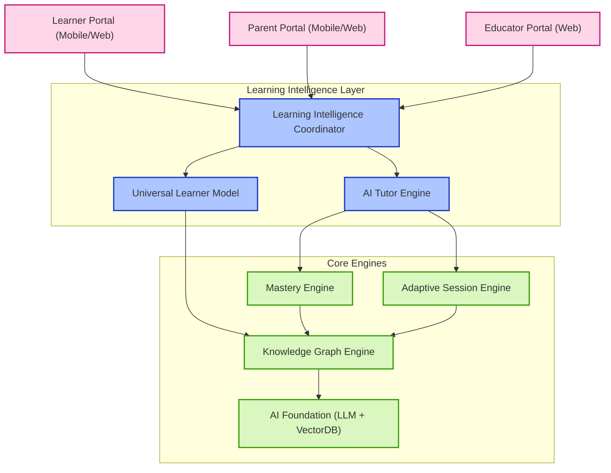
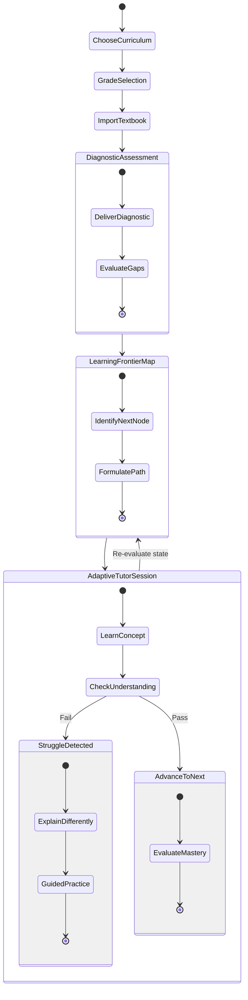

# EKAGURU Experience Blueprint & GUI Architecture

This document establishes the product vision, user experience blueprint, and domain model architecture for **EKAGURU — The Learning Access Layer**. It guides the transition from a collection of isolated backend features to a cohesive, unified, curriculum-agnostic intelligence layer.

---

## 1. Unified GUI Architecture

Rather than separate dashboards, EKAGURU functions as a single **Learning Intelligence Layer** serving three distinct user portals on top of shared core engines:



---

## 2. Learner Journey: The Loop of Active Learning

The learner journey is centered around a feedback loop designed to prevent frustration:



### Learner Journey Stages
1. **Onboarding & Curriculum Selection**: The learner specifies their target education system (e.g. CBSE, NCERT, IB) and grade level.
2. **Textbook & Asset Import**: The learner uploads photos or PDFs of their school textbook or learning materials. EKAGURU structures the text and aligns it with the underlying curriculum Knowledge Graph.
3. **Diagnostic Assessment**: A brief, low-friction diagnostic session establishes the learner's baseline.
4. **Learning Frontier Map**: A visual, non-intimidating dashboard showing completed concepts, active nodes, and the next milestones.
5. **Adaptive Tutor Session ("Teach Me")**: The interactive learning interface where the AI Tutor acts as a conversational partner.

---

## 3. Parent Journey & Today's Learning Experience

The Parent Portal provides a window into the child's learning history and highlights areas requiring attention.

### Parent Dashboard Wireframe Schema

```
Good evening, Parent

Your child is learning Mathematics
━━━━━━━━━━━━━━━━━━━━━━━━━━━━━━━━━━━━━━━━━━━━━━━━━━━━━━━━━

        TODAY'S LEARNING

        Fractions
        ███████████░░ 82%

        ✓ Understands (Concept definition verified)
        ✓ Practiced (Answered 5 practice questions)
        ⚠ Needs reinforcement (Struggling with division)

━━━━━━━━━━━━━━━━━━━━━━━━━━━━━━━━━━━━━━━━━━━━━━━━━━━━━━━━━

       WHAT NEEDS YOUR ATTENTION?

  ⚠ Fractions
    - 3 assessment struggles this week.
    - Misconception identified: Adding denominators directly.

  💡 Recommended Action:
    - Launch a 12-minute guided practice session on "Equivalent Denominators".

━━━━━━━━━━━━━━━━━━━━━━━━━━━━━━━━━━━━━━━━━━━━━━━━━━━━━━━━━

       YOUR CHILD'S JOURNEY

        Understand ──> Practice ──> Strengthen ──> Master ──> Remember
           [✓]          [✓]          [⚠]          [ ]          [ ]
```

### Key Parent Metrics
* **Learning Health Status**: Rather than static grading percentages, health is evaluated as `ACTIVE`, `NEEDS_REINFORCEMENT`, or `STUCK`.
* **Attention Signals**: Triggered dynamically when outbox assessment struggles exceed threshold levels.
* **Recommended Intervention**: Provides actionable tasks (e.g. "Do a 12-minute joint practice session") rather than passive statistics.

---

## 4. Tutor UX Engine Model

The AI Tutor Engine coordinates the conversational pedagogy:

* **Avatar & Persona**: Friendly, encouraging, and supportive tutor. Adapts narrative lens dynamically (e.g., uses simpler analogies for younger kids, structured principles for advanced learners).
* **Conversational Pedagogy**:
  * **No Information Dumping**: The tutor explains concepts in short paragraphs (max 3 sentences) accompanied by visual formatting.
  * **Socratic Questioning**: Instead of providing answers, the tutor asks guiding questions to help the child discover the solution.
  * **Hint Strategy**: Progressive hint delivery (Level 1: General clue, Level 2: Conceptual guide, Level 3: Step-by-step resolution).
  * **Misconception Detection**: Analyzes child responses to identify structural misunderstandings (e.g., adding denominators directly like $1/2 + 1/3 = 2/5$) and transitions to targeted remediation.

---

## 5. Universal Learner Model Schema

The Universal Learner Model represents the complete state of a student's knowledge. It is stored as a structured JSON contract:

```json
{
  "learnerId": "9b1deb4d-3b7d-4bad-9bdd-2b0d7b3dcb6d",
  "identity": {
    "name": "Arjun",
    "age": 10,
    "preferredLanguage": "hi",
    "narrativeRole": "STUDENT"
  },
  "curriculumContext": {
    "board": "CBSE",
    "grade": "5",
    "subject": "Mathematics",
    "currentUnitId": "unit-fractions"
  },
  "knowledgeState": {
    "masteredNodeIds": [
      "frac-intro",
      "frac-visual-representation"
    ],
    "activeNodeIds": [
      "frac-addition-like"
    ],
    "struggleNodeIds": [
      "frac-addition-unlike"
    ]
  },
  "masteryProfile": {
    "frac-intro": 0.95,
    "frac-visual-representation": 0.90,
    "frac-addition-like": 0.72,
    "frac-addition-unlike": 0.35
  },
  "misconceptions": [
    {
      "nodeId": "frac-addition-unlike",
      "tag": "ADD_DENOMINATORS_DIRECTLY",
      "count": 3,
      "lastObserved": "2026-08-23T00:05:00Z"
    }
  ],
  "learningHistory": {
    "streakDays": 4,
    "lastActive": "2026-08-23T00:05:00Z",
    "totalMinutesSpent": 142
  },
  "nextBestAction": {
    "actionType": "REMEDIATION",
    "targetNodeId": "frac-addition-unlike",
    "reason": "Address misconception ADD_DENOMINATORS_DIRECTLY using equivalent fraction strip animations."
  }
}
```

---

## 6. Curriculum Interoperability Layer

EKAGURU achieves curriculum interoperability through a unified metadata bridge:

```
[ CBSE Curriculum ] ──┐
[ ICSE Curriculum ] ──┼──> [ EKAGURU Universal Metadata Bridge ] ──> [ Universal Knowledge Graph ]
[ NCERT Syllabus  ] ──┘
```

Every supported board, textbook chapter, or custom course syllabus maps to the **Universal Knowledge Graph** via three core schema relationships:
1. `PREREQUISITE`: Concept A must be completed before starting Concept B.
2. `COMPONENT_OF`: Concept A is a sub-topic of the larger concept B.
3. `EQUIVALENT_TO`: Matches boards together (e.g. CBSE Grade 5 "Fractions" matches IGCSE Grade 5 "Fractions & Decimals").

---

## 7. Staging Hardening Verdict

Following the execution of E2-009, the outbox sweeper cron has been updated to 5 minutes, satisfying the target recovery SLO:

### Sweeper Recovery SLO Verification
$$\text{Max Recovery Latency} = \text{Stuck Lock Timeout (15 mins)} + \text{Sweeper Cron Interval (5 mins)} = 20\text{ minutes (🟢 SLO Pass)}$$

### Production Kubernetes Rolling Deployment Manifest Contract
To ensure zero connection errors during rolling updates, the following deployment manifest structures are configured:

```yaml
apiVersion: apps/v1
kind: Deployment
metadata:
  name: api-deployment
spec:
  replicas: 2
  template:
    spec:
      containers:
      - name: api
        image: ekaguru-api:v2
        lifecycle:
          preStop:
            exec:
              command: ["sh", "-c", "sleep 10"]
        readinessProbe:
          httpGet:
            path: /api/v2/health
            port: 20000
          initialDelaySeconds: 5
          periodSeconds: 5
          failureThreshold: 2
```
